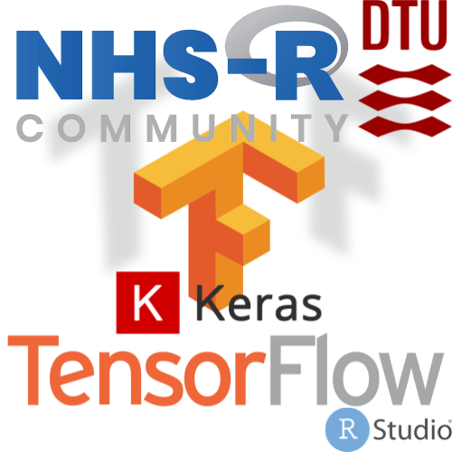

NHS-R Conference Workshop: Artificial neural networks in R with Keras
and TensorFlow
================

## Introduction

  - The UK National Health Service is hosting a [virtual R conference
    Nov. 2nd-13th 2020](https://nhsrcommunity.com/events/nhs-r-virtual-conference-2020/).
    This workshop is part of the workshop series and was conducted
    Thursday November 5th 2020 09:30 - 13:30 (GMT).

  - The workshop was hosted by [Leon Eyrich
    Jessen](https://rinpharma.com/workshops/leon-jessen/)

## Abstract

The aim of this workshop is an introduction to Artificial neural
networks in R with Keras and TensorFlow. ANNs form the basic unit of
deep learning and are immensely powerful in predictive modeling, but not
without pitfalls. In this workshop, we will be working with conceptually
understanding what an ANN is, how we train an ANN and how predictions
are subsequently made. We will also touch upon parameters,
hyper-parameters and how to handle data all in context of model
over-fitting. The workshop assumes basic R/Data Science skills. Please
note, the workshop is very hands-on oriented, so expect to get your
fingers dirty\!

## Workshop Schedule

Total time 4h: 09.30-13.30 (GMT)

*Important: All slides are available in the `Talks`-dir in your RStudio
session `Files` pane, left-click on the `.html` file and choose ‘View in
Web Browser’. The exercises are in the `Exercises`-dir, left-click on
the `00_exercises.html` file and choose ‘View in Web Browser’)*

  - 09.30 - 09.50 (20min) [Talk: Introduction to Artificial Neural
    Networks](Talks/01_introduction_to_artificial_neural_networks.html)

  - 09.50 - 10.20 (30min) [Exercise 1: Prototyping an ANN in
    R](https://htmlpreview.github.io/?https://github.com/leonjessen/NHSR2020/blob/main/Exercises/00_exercises.html#1_Prototyping_an_ANN_in_R)

  - 10.20 - 10.30 (10min) Break I

  - 10.30 - 10.35 (5min) Exercise 1 walk-through

  - 10.35 - 10.40 (5min) [Brief talk: Introduction to TensorFlow/Keras
    in R part 1](Talks/02_introduction_to_keras_1.html)

  - 10.40 - 11.00 (20min) [Exercise 2: TensorFlow
    Playground](https://htmlpreview.github.io/?https://github.com/leonjessen/NHSR2020/blob/main/Exercises/00_exercises.html#2_TensorFlow_Playground)

  - 11.00 - 11.10 Exercise 2 walk-through

  - 11.10 - 11.15 (5min) [Brief talk: Introduction to TensorFlow/Keras
    in R part 2](Talks/03_introduction_to_keras_2.html)

  - 11.15 - 11.20 (5min) [Brief talk: Session 1 Summary and
    Q\&A](Talks/04_session_1_summary.html)

  - 11.20 - 11.30 (10min) Break II

  - 11.30 - 12.00 (30min) [Exercise 3: Hello
    Keras](https://htmlpreview.github.io/?https://github.com/leonjessen/NHSR2020/blob/main/Exercises/00_exercises.html#3_Hello_Keras)

  - 12.00 - 12.15 (15min) [Brief talk and exercise 3 walk-through: A bit
    more on Keras](Talks/05_a_bit_more_on_keras.html)

  - 12.15 - 12.25 (10min) Break III

  - 12.25 - 12.55 (30min) Exercise 4: Now, you must choose between:
    
      - [Exercise 4a: Predicting commodity prices
        (regression)](https://htmlpreview.github.io/?https://github.com/leonjessen/NHSR2020/blob/main/Exercises/00_exercises.html#4a_Predicting_commodity_prices_\(regression\))
        or
      - [Exercise 4b: Deep Learning for Cancer Immunotherapy
        (Classification)](https://htmlpreview.github.io/?https://github.com/leonjessen/NHSR2020/blob/main/Exercises/00_exercises.html#4b_Deep_Learning_for_Cancer_Immunotherapy_\(Classification\))

  - 12.55 - 13.20 (25min) [Exercise 5: A Case
    Story](https://htmlpreview.github.io/?https://github.com/leonjessen/NHSR2020/blob/main/Exercises/00_exercises.html#5_A_Case_Story)

  - 13.20 - 13.30 (10min) [Brief talk and exercise 5 walk-through:
    Session 2 Summary](Talks/06_session_2_summary.html)

## Additional Resources

### Web

  - [R Interface to TensorFlow](https://tensorflow.rstudio.com/)
  - [R interface to Keras](https://tensorflow.rstudio.com/keras/)
  - [Keras
    Examples](https://tensorflow.rstudio.com/keras/articles/examples/)
  - [RStudio AI blog](https://blogs.rstudio.com/ai/)
  - [Learning
    Resources](https://tensorflow.rstudio.com/learn/resources/)
  - [RStudio Community](https://community.rstudio.com/)
  - [RStudio Cloud](https://rstudio.cloud/)
  - [Deep Learning with Keras
    Cheatsheet](https://github.com/rstudio/cheatsheets/raw/master/keras.pdf)

### Books

  - [Deep Learning with
    R](https://www.manning.com/books/deep-learning-with-r)
  - [Free: Deep Learning book](https://www.deeplearningbook.org/)
